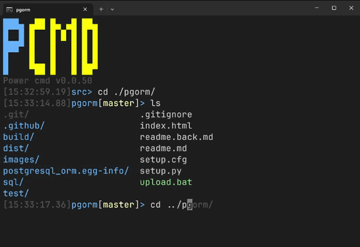

# 2026 UPDATE: pcmd.exe (Moved from batch files to single executable)




## Why

Plain `cmd.exe` has been frustrating Windows developers for decades. Here is what finally pushed this project from batch scripts into a full C++ shell:

- **No tab completion for `cd`** — you could not tab-complete `../` or parent folder paths
- **No persistent history** — every time you closed the terminal your command history was gone
- **Multiline paste was broken** — pasting a curl command copied from Chrome (with `^` or `\` line continuations) sent each line separately and made cmd go nuts
- **No history hinting** — no ghost text, no suggestions as you type, nothing
- **Prompt could not refresh on Enter** — blank Enter in cmd does nothing, so the clock in the prompt would freeze and never update
- **No colored `ls`** — `dir` exists but it is not `ls`, and it has no colors

The batch-based powerline (`init.bat`, `_set.bat`) solved the prompt styling but hit a hard ceiling: it still ran *inside* cmd.exe and could not work around these fundamental limits.

The answer was a **500 KB standalone executable, single `.cpp` file**, easy to compile, that runs *directly* as your shell — not as a child of cmd — while still delegating command execution to cmd so nothing breaks.

## Architecture

```
Windows Terminal
└── pcmd.exe  (permanent process, entire session)
        │
        ├── built-ins handled directly in C++
        │   cd, ls, exit, history, auto-cd, prompt, hints...
        │
        └── everything else → cmd.exe /c <command>  (spawned per command, exits when done)
                                    │
                                    └── piping, redirection, %VAR% expansion,
                                        batch files, dir, echo, set, &&, ||...
```

`pcmd.exe` owns the input loop and UX. `cmd.exe` is a temporary worker used for execution — you get full Windows command compatibility without `pcmd.exe` needing to reimplement any of it.

## Features

**Prompt**
- `[time]folder[branch*]>` format with 256-color ANSI
- Git branch and dirty status (reads `.git/HEAD` directly — no process spawn)
- Exit code shown in red `[1]` when last command failed
- Red folder color when running elevated (admin)
- Window title shows folder name at rest, command name while running
- Prompt never appears mid-line — detects partial output and adds newline automatically

**Input**
- Full line editing with cursor movement
- `Ctrl+Left` / `Ctrl+Right` — word jump
- `Home` / `End` — line start/end
- `Ctrl+C` — cancel current input or interrupt running command
- History hints — gray ghost text from history as you type, `→` or `End` to accept
- Tab completion — files and directories, dirs-only after `cd`
- Forward slashes in completion paths
- Multiline paste — `^` and `\` line continuation, each segment shown with `>` prompt

**History**
- Persistent across sessions (`%USERPROFILE%\.history`)
- Saved on `exit`, window close, logoff, and shutdown
- No consecutive duplicates saved
- `Up` / `Down` to navigate

**Built-in commands**
- `ls` — colored directory listing (dirs blue, executables green, archives red, images magenta, audio/video cyan, hidden gray)
- `cd` — with `/d` flag support
- Auto-cd — type a directory path and Enter, no `cd` needed
- `cd ~` and `~` in paths expand to `%USERPROFILE%`

**Execution**
- Blank Enter refreshes the prompt (impossible in pure batch)
- Ctrl+C correctly stops child processes
- New prompt appears after every command automatically

## Setup

### Windows Terminal

Point your profile's command line directly at `pcmd.exe`:

```json
{
    "commandline": "C:\\src\\powerline\\pcmd.exe",
    "fontFace": "JetBrains Mono"
}
```

### VSCode

```json
{
    "terminal.integrated.profiles.windows": {
        "pcmd": {
            "path": [
                "d:\\src\\powerline\\pcmd.exe"
            ]
        }
    },
    "terminal.integrated.defaultProfile.windows": "pcmd"
}
```

## Release

The release is a single file: **`pcmd.exe`**. No runtime, no DLLs, no config files required. Built against the Windows SDK only.

Download the latest `pcmd-v0.0.X.zip` from the [Releases](../../releases) page, extract, and point your terminal profile at `pcmd.exe`.

To build from source:
```
g++ pcmd.cpp -o pcmd.exe -DVERSION_MINOR=X -ladvapi32 -lshell32
```
or just run `build.bat` which auto-increments the version.

---

> The original batch-based powerline system is documented in [batch/readme.md](./batch/readme.md).
